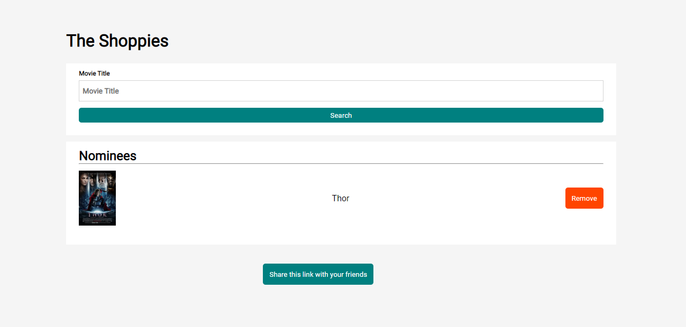
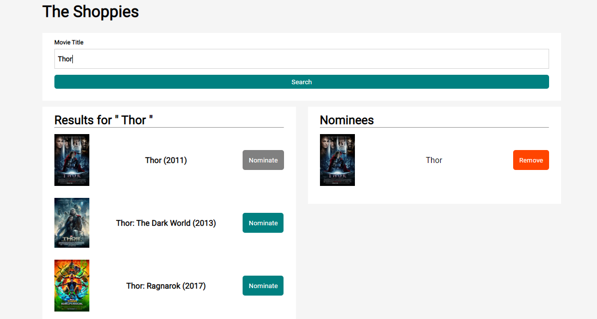
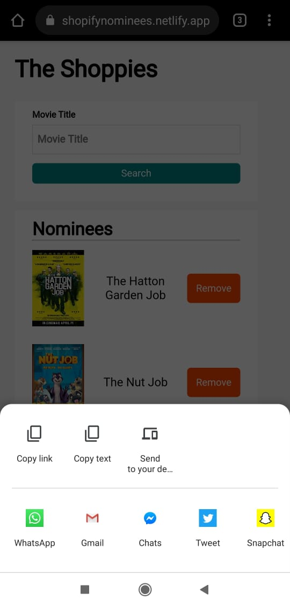

# The Shoppies

Visit by clicking the badge above

##### Technologies Used
  - React.js
  - OMDB API
  - React Context API for state management

Feautures 
----
  - Search for movies by their titles
  - Add/Remove movies from nomination list
  - Storing nomination kist locally to persist the records
  - Website link sharing using web share API and fallback to clipboard api
  - Animations on adding/removing elements in nominations

Screenshots
----
HomePage

Search Result and Nominations

WebShare API

**KEEP learning!**